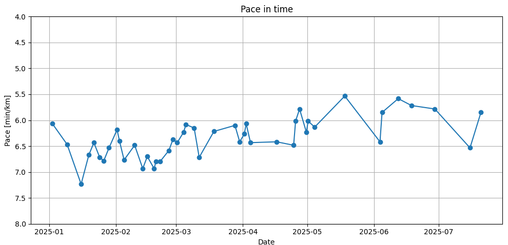

# StravaPaceAnalyzerAPI

An HTTP API for analyzing pace-related metrics from Strava activities.  
The project handles **Strava OAuth 2.0 authentication**, including **automatic refresh and rotation of tokens**.

---

## Features

- Fetching information about your trainings to calculate and show your running pace progress
- Reduce API requests by putting already downloaded activities to database
- Login & authentication against Strava API  
- Automatic token refresh with **rotation of refresh tokens**  
- Configurable via `.env`  
- Simple HTTP API to access pace analytics  
- Logging & test coverage

---

## Installation

Clone the repo and install dependencies:

```bash
git clone https://github.com/kamilmatuszewski111/StravaPaceAnalyzerAPI.git
cd StravaPaceAnalyzerAPI
python -m venv .venv && source .venv/bin/activate
pip install -r requirements.txt
```
## Getting the first token

1. Go to https://www.strava.com/settings/api
2. Create an application and copy **Client ID** and **Client Secret**.
3. Build the authorization URL, where YOUR_CLIENT_ID is Client ID from Strava application and YOUR_REDIRECT_URI is e.g. http://localhost:8000/oauth/callback

https://www.strava.com/oauth/authorize?client_id=YOUR_CLIENT_ID&response_type=code&redirect_uri=YOUR_REDIRECT_URI&scope=read,activity:read_all

4. Open in browser, change required data, approve, copy the `code` parameter from redirect URL.
5. Exchange the code for tokens: \

        requests.post(
            TOKEN_URL,
            data={
                "client_id": YOUR_CLIENT_ID,
                "client_secret": YOUR_CLIENT_SECRET,
                "code"=YOUR_CODE_FROM_URL
                "grant_type": "authorization_code",
            },
        )
6. You will receive JSON with:
- `access_token` → short-lived
- `refresh_token` → long-lived, rotating
- `expires_at` → expiry time (epoch seconds)

Put them into your `.env`.

⚠️ Strava rotates refresh tokens — always persist the latest refresh token returned during refresh.

## Running
 In main function there are two variables which script will as you tu put in right format:
```
    Start date in YYYY-MM-DD format>
    End date in YYYY-MM-DD format>
```
 Then by default my script is filtering only for 'Run' activity
 
Below you can check example response:

```
2025-08-27 19:05:12.370 | INFO     | source.api:get_activities:31 - Getting Run activities from 2025-01-01 to 2025-07-24
2025-08-27 19:05:12.370 | INFO     | source.token_manager:refresh_access_token:53 - Refreshing access token...
2025-08-27 19:05:12.871 | INFO     | source.token_manager:_save_tokens:41 - Saving tokens to .env
2025-08-27 19:05:12.872 | INFO     | source.token_manager:_load_tokens:24 - Loading tokens...
2025-08-27 19:05:12.873 | SUCCESS  | source.token_manager:refresh_access_token:70 - Token refreshed successfully.
2025-08-27 19:05:15.429 | SUCCESS  | source.api:get_activities:40 - Successfully retrieved activities.
2025-08-27 19:05:15.430 | INFO     | source.api:get_activities:48 - Filtered 14 activities of type(s): ['Run']
```
As you can see my script have found 14 activities for Run in specified time range.

If activity was previously found the script is checking database, if activity is already stored you will receive:
```commandline
2025-08-27 19:13:00.185 | INFO     | __main__:<module>:2 - 14341007768 | Morning Run | 2025-05-01T10:33:16Z | 7.02 km
2025-08-27 19:13:00.185 | INFO     | source.database:check_if_data_exist:46 - Activity with id 14341007768 already exists in database. Fetching skipped.

```
After this the script will take your activities where average pace was in set range e.g. 60-155 bmp.

At the end the script will show you waveform with paces in time range, like below:




## Automatic token renewal

The app automatically refreshes tokens when they are close to expiry:
- Checks `expires_at` before each API call.
- If expired → calls Strava refresh endpoint.
- Saves new access token, refresh token, and expires_at.
- This makes the app fully headless after the first setup.

## Notes


Rate limits: Default Strava limits — 100 requests per 15 min, 1000 per day (non-upload). Handle HTTP 429 with backoff.

Secrets: Never commit .env or tokens. Use secret managers in CI/CD.

Logging: Do not log tokens; log only expiry timestamps.

